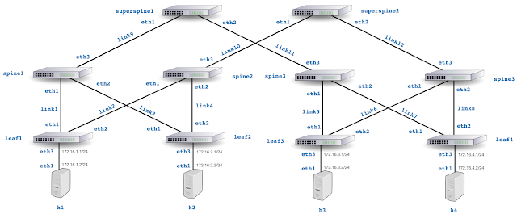
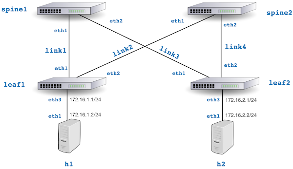

# containerlab
Experiment with real-time network telemetry using [containerlab](https://containerlab.srlinux.dev/) to simulate 3 and 5 stage Clos (leaf/spine) fabrics.

## 5 Stage Clos Topology

Deploy 5 stage Clos topology:

`containerlab deploy -t clos5.yml`

Generate traffic between `h1` and `h4`:

`docker exec -it clab-clos5-h1 iperf3 -c 172.16.4.2`

Connect to http://localhost:8008/ for analytics, see [Quickstart](https://sflow-rt.com/intro.php) for more information.

## 3 Stage Clos Topology

Deploy 3 stage Clos topology:

`containerlab deploy -t clos3.yml`

Generate traffic between `h1` and `h2`:

`docker exec -it clab-clos3-h1 iperf3 -c 172.16.2.2`

Connect to http://localhost:8008/ for analytics, see [Quickstart](https://sflow-rt.com/intro.php) for more information.
