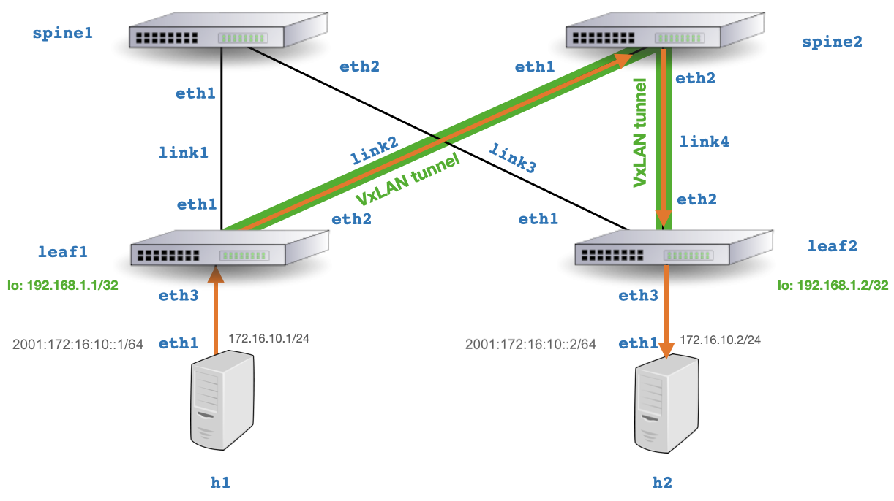
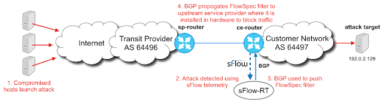
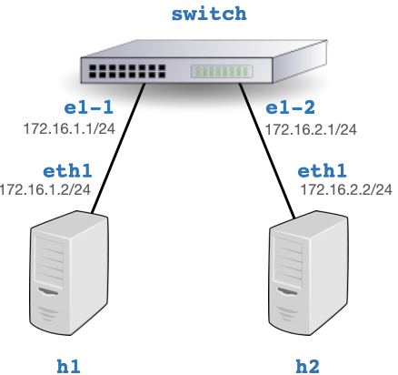

# containerlab
Experiment with real-time network telemetry using [containerlab](https://containerlab.dev/) to simulate Clos (leaf/spine) fabrics.

* [Real-time telemetry from a 5 stage Clos fabric](https://blog.sflow.com/2022/02/real-time-telemetry-from-5-stage-clos.html)
* [Topology aware fabric analytics](https://blog.sflow.com/2022/02/topology-aware-fabric-analytics.html)
* [Real-time EVPN fabric visibility](https://blog.sflow.com/2022/03/real-time-evpn-fabric-visibility.html)
* [Containerlab DDoS testbed](https://blog.sflow.com/2022/03/containerlab-ddos-testbed.html)
* [DDoS attacks and BGP Flowspec responses](https://blog.sflow.com/2022/03/ddos-attacks-and-bgp-flowspec-responses.html)
* [BGP Remotely Triggered Blackhole (RTBH)](https://blog.sflow.com/2022/04/bgp-remotely-triggered-blackhole-rtbh.html)
* [SR Linux in Containerlab](https://blog.sflow.com/2022/07/sr-linux-in-containerlab.html)
* [Real-time flow analytics with Containerlab templates](https://blog.sflow.com/2023/02/real-time-flow-analytics-with.html)
* [Leaf and spine network emulation on Mac OS M1/M2 systems](https://blog.sflow.com/2023/05/leaf-and-spine-network-emulation-on-mac.html)

## 5 Stage Clos Topology

Deploy 5 stage Clos topology:

`containerlab deploy -t clos5.yml`

Generate traffic between `h1` and `h4`:

`docker exec -it clab-clos5-h1 iperf3 -c 172.16.4.2`

`docker exec -it clab-clos5-h1 iperf3 -c 2001:172:16:4::2`

Connect to http://localhost:8008/ for analytics, see [Quickstart](https://sflow-rt.com/intro.php) for more information.

## 3 Stage Clos Topology

Deploy 3 stage Clos topology:

`containerlab deploy -t clos3.yml`

Generate traffic between `h1` and `h2`:

`docker exec -it clab-clos3-h1 iperf3 -c 172.16.2.2`

`docker exec -it clab-clos3-h1 iperf3 -c 2001:172:16:2::2`

Connect to http://localhost:8008/ for analytics, see [Quickstart](https://sflow-rt.com/intro.php) for more information.

# EVPN Topology

Deploy EVPN topology:

`containerlab deploy -t evpn3.yml`

Generate traffic between `h1` and `h2`:

`docker exec -it clab-evpn3-h1 iperf3 -c 172.16.10.2`

`docker exec -it clab-evpn3-h1 iperf3 -c 2001:172:16:10::2`

Connect to http://localhost:8008/ for analytics, see [Quickstart](https://sflow-rt.com/intro.php) for more information.

# DDoS Topology

Deploy DDOS topology:

`containerlab deploy -t ddos.yml`

Simulate DDoS attack against `victim`:

`docker exec -it clab-ddos-attacker hping3 --flood --udp -k -a 198.51.100.1 -s 53 192.0.2.129`

Connect to http://localhost:8008/ for analytics, see [Quickstart](https://sflow-rt.com/intro.php) for more information.

# Nokia SR Linux

Deploy SR Linux topology:

`containerlab deploy -t srlinux.yml`

Simulate traffic:

`docker exec -it clab-srlinux-h1 iperf3 -c 172.16.2.2`

Connect to http://localhost:8008/ for analytics, see [Quickstart](https://sflow-rt.com/intro.php) for more information.
